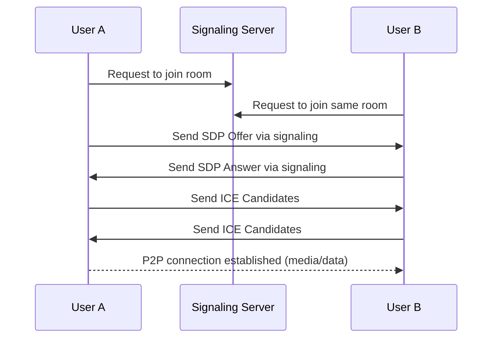

# WebRTC: Core Concepts, How It Works, and Code Snippets

WebRTC (Web Real-Time Communication) is a technology that enables **real-time audio, video, and data communication** directly between browsers and devices — **without needing plugins** or third-party software. Learn more [here](https://youtu.be/pGAp5rxv6II?si=vG8mYPWHS7zIj_Kl).


## Main Features: 

* Real-time **video and audio calling**
* **Peer-to-peer** data transfer
* Built into browsers (Chrome, Firefox, Safari, etc.)


## Key Components of WebRTC 

| Component                               | Purpose                                                                           |
| --------------------------------------- | --------------------------------------------------------------------------------- |
| **Media Capture#**                      | Captures user’s camera and microphone using `getUserMedia()`                      |
| **Peer Connection (RTCPeerConnection)** | Manages the direct connection between two peers                                   |
| **Signaling**                           | Helps peers exchange connection information (offers, answers, and ICE candidates) |
| **STUN/TURN Servers**                   | Help discover and traverse NAT/firewalls                                          |


## WebRTC Protocol Stack 

WebRTC uses several protocols under the hood:

| Layer             | Protocol        | Purpose                                                        |
| ----------------- | --------------- | -------------------------------------------------------------- |
| **Transport**     | UDP / TCP       | Primary data transport (UDP preferred for low latency)         |
| **NAT Traversal** | ICE, STUN, TURN | Help peers discover each other and punch through NAT/firewalls |
| **Security#**     | DTLS            | Encrypts communication (TLS over UDP)                          |
| **Media**         | SRTP            | Securely transmits audio/video                                 |
| **Data#**         | SCTP            | Used for reliable/unreliable data channels                     |


## WebRTC Connection Flow (Simple Steps) 



1. **Get User Media:** Both peers access mic/camera.
2. **Signaling:** Uses sockets to exchange info (SDP and ICE).
3. **ICE Framework:** Finds best path using STUN/TURN.
4. **SDP Offer/Answer:** Used to negotiate media capabilities.
5. **Establish Peer Connection:** Media flows directly between peers (P2P).


## Security 

* WebRTC uses **DTLS** (Datagram Transport Layer Security) and **SRTP** (Secure RTP) to encrypt all communication.
* Data channels are encrypted by default via **SCTP over DTLS**.

## Summary: What You Need to Build a WebRTC App**

1. A **signaling server** (e.g., with Socket.IO)
2. Frontend logic to:

   * Capture media
   * Setup peer connection
   * Exchange offers/answers/ICE via signaling
3. Optionally: Use **TURN** server when STUN fails behind strict NAT/firewalls


# 1. Initialize RTCPeerConnection

```js
const peerConnection = new RTCPeerConnection({
  iceServers: [
    { urls: "stun:stun.l.google.com:19302" },
    { urls: "stun:stun1.l.google.com:19302" },
    { urls: "stun:stun2.l.google.com:19302" }
  ]
});
```

# 2. Access Local Media (Camera & Mic)

```js
const stream = await navigator.mediaDevices.getUserMedia({ video: true, audio: true });
localVideoRef.current.srcObject = stream;

stream.getTracks().forEach(track => {
  peerConnection.addTrack(track, stream);
});
```

# 3. Handle Incoming Remote Stream

```js
peerConnection.ontrack = (event) => {
  const remoteStream = event.streams[0];
  remoteVideoRef.current.srcObject = remoteStream;
};
```

# 4. Handle ICE Candidates

```js
peerConnection.onicecandidate = (event) => {
  if (event.candidate) {
    socket.emit("ice-candidate", { roomId, candidate: event.candidate });
  }
};

// Receiving ICE candidate
socket.on("ice-candidate", async ({ candidate }) => {
  if (candidate) {
    await peerConnection.addIceCandidate(new RTCIceCandidate(candidate));
  }
});
```

# 5. Create Offer (Caller Side)

```js
const offer = await peerConnection.createOffer();
await peerConnection.setLocalDescription(offer);

socket.emit("offer", { roomId, offer });
```

# 6. Handle Offer & Create Answer (Receiver Side)

```js
socket.on("offer", async ({ offer }) => {
  await peerConnection.setRemoteDescription(new RTCSessionDescription(offer));

  const answer = await peerConnection.createAnswer();
  await peerConnection.setLocalDescription(answer);

  socket.emit("answer", { roomId, answer });
});
```

# 7. Handle Answer (Caller Side)

```js
socket.on("answer", async ({ answer }) => {
  await peerConnection.setRemoteDescription(new RTCSessionDescription(answer));
});
```

# 8. Mute/Unmute Audio

```js
const toggleAudio = () => {
  const audioTracks = localStream.getAudioTracks();
  audioTracks.forEach(track => {
    track.enabled = !track.enabled;
  });
};
```

# 9. Turn Off/On Video

```js
const toggleVideo = () => {
  const videoTracks = localStream.getVideoTracks();
  videoTracks.forEach(track => {
    track.enabled = !track.enabled;
  });
};
```


# 10. End Call

```js
const endCall = () => {
  // Stop all local media tracks
  localStream.getTracks().forEach(track => track.stop());

  // Close peer connection
  peerConnection.close();

  // Optional: emit leave-room event
  socket.emit("leave-room", { roomId });
};
```

# 11. Cleanup on Component Unmount

```js
return () => {
  socket.off("offer");
  socket.off("answer");
  socket.off("ice-candidate");

  if (peerConnection) peerConnection.close();
  if (localStream) localStream.getTracks().forEach(track => track.stop());
};
```

# WebRTC Signaling Summary

| Event           | Description                                |
| --------------- | ------------------------------------------ |
| `offer`         | Sent from caller with SDP offer            |
| `answer`        | Sent by callee in response to the offer    |
| `ice-candidate` | Exchanged by both peers to establish route |
| `ontrack`       | Receives remote media stream               |
